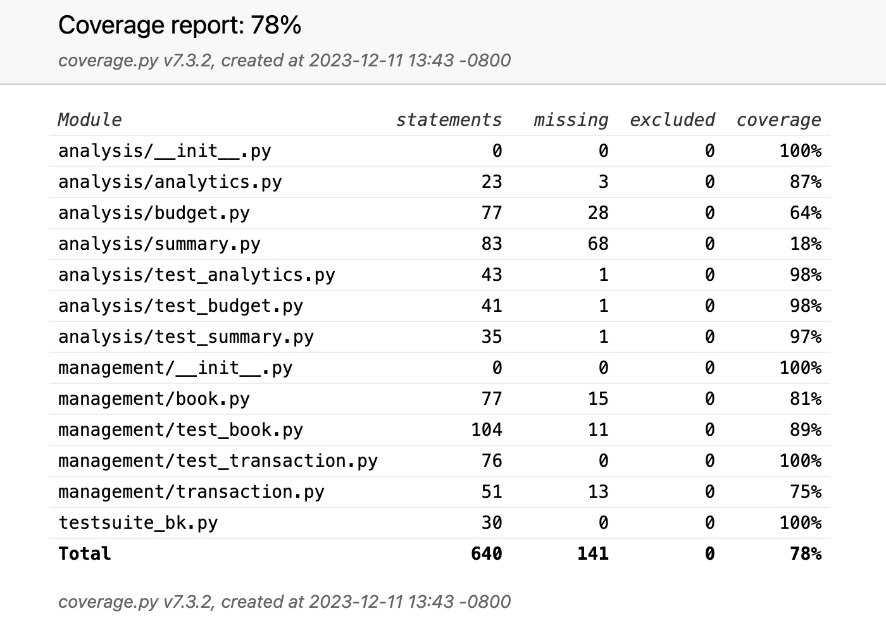

# Bookkeeping Project
## Build Stamp
  

## Coverage Report
Please note that the coverage percentage for analysis/budget.py and analysis/summary.py are lower than 75% because unit tests cannot be appropriately applied to some functions for visualization as agreed upon by the instructor.

 

## Link to PyPi for Package Publish
https://pypi.org/project/bookkeeping/0.0.8/