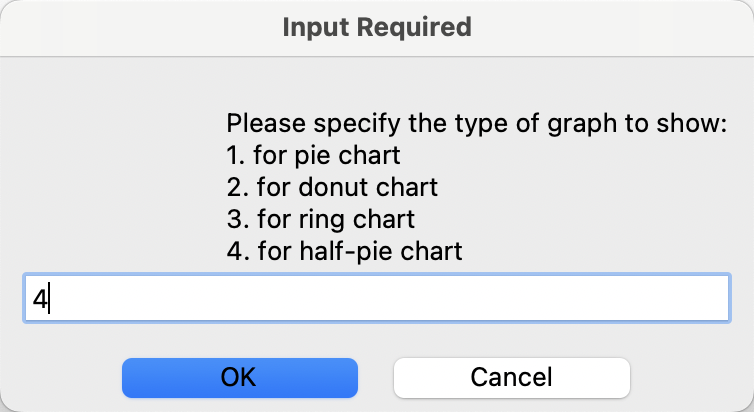

# Bookkeeping Package

## Overview
This package provide two main functionalities: transaction management and analysis, which are separatly designed in two sub-packages: management and analysis

## Table of Contents
- Sub-package: management
  - Module 1: transaction
  - Module 2: book
- Sub-package: analysis
  - Module 1: analytics
  - Module 2: summary
  - Module 3: budget
- Test file: How to use

## Sub-package: management

### Module 1: transaction
#### Transaction Class 
Initiates an object that represents a single transaction record that contains information of a single user, date, and amount in this specific transaction

**__init__(amount, desc, label=None)**: Initializes a new Transaction object.Parameters:amount: numeric value representing the transaction amount. desc: string describing the transaction. label: string representing the category or label of the transaction. Defaults to "other" if not provided.

**Setters**: ```setLabel(newLabel)```; ```setAmount(newAmount)```; ```setDate(newDate)```

**toDict()**: converts the transaction to a dictionary. Returns: a dictionary representation of the transaction.

**__str__()**: returns a string representation of the transaction.

#### Income Class
A subclass of Transaction class that represents Income object

**Class Attribute**: incomeLabels that contains the pre-set income labels

**__init__()**: Initializes a new Income object by inheriting the ```__init()__``` of Transaction class

#### Expense Class
A subclass of Transaction class that represents Expense object

**Class Attribute**: expenseLabels that contains pre-set expense labels

**__init__()**: Initializes a new Expense object by inheriting the ```__init()__``` of Transaction class.

### Module 2: book
#### Book Class
This class represents the Book object that keeps records of all transactions of a single user.

**__init__(filePath = "userbook.json")**: Initializes a new Book object with a file path where a JSON file is to be saved. filePath is set to be "userbook.json" in default if not specified. Loads existing data from filePath if available, otherwise creates an empty book with the specified JSON name in the file path.

**saveData(filePath = "userbook.json")**: Saves the current state of the book to the JSON file in the filePath.

**loadData(filePath = "userbook.json")**: Loads data from the JSON file in the filePath into the book. If the file is not found or is not valid JSON, initializes the book with empty lists for 'income' and 'expense'.

**addTran(transanction, filePath = "userbook.json")**: Adds a transaction to the book and saves the updated data into the JSON file in the filePath by taking an instance of the Income or Expense class.

**searchTran(t_type, keyword)**: Searches for transactions of a given type of transaction containing a keyword in their description and prints the results. 
Parameters: t_type: string, either 'income' or 'expense'. keyword: string to search for in transaction descriptions. 

**removeTran(t_type, index, filePath = "userbook.json")**: Removes a transaction from the book based on its type and index, then saves the updated data into the JSON file in the filePath. Parameters: t_type: String, either 'income' or 'expense'. index: Index of the transaction to be removed.

**clearAll(filePath = "userbook.json")**: Clears all transactions in both 'income' and 'expense' categories and saves the updated data into the JSON file in the filePath.

**displayBook()**: Displays all transactions in the book.

## Sub-package: analysis
### Module 1: analytics
#### Analysis Class
The `Analysis` class is designed to load transaction data from a JSON file and store it in an attribute. This class serves as a base class for SummaryAnalysis class and BudgetAnalysis class.

**__init__()**: Initializes an instance of the Analysis class. This will automatically load transaction data from the default JSON file.

**loadBookData()**: Loads transaction data from the JSON file and returns a list of transactions. This method is automatically called during the initialization of the Analysis class.

### Module 2: summary
#### SummaryAnalysis CLass
The `SummaryAnalysis` class is designed to perform basic analysis on monthly transactions.  
It inherits from a base class `Analysis`. This class provides methods to check the overall balance for the current month, display trends in income, expenses, and balance over months using line or bar charts, and visualize the composition of income or expenses using pie charts.

**__init__()**: Creates an instance of the SummaryAnalysis class.

**checkBalance()**: Calculates the overall balance for the current month and prints the result.

**displayTrend(graph_type=2)**: Plots a line chart or bar chart to represent the monthly trend of income, expenses, and balance.

- `graph_type`: (default `2`)
    - `1`: a line chart 
    - `2`: a bar chart

**displayByLabel(transaction_type="expense", graph_type=1)**: Plots a pie chart, donut chart, ring chart, or half-pie chart to represent the constitution of income or expenses by label.

- `transaction_type`: (default `expense`)
    - `income`
    - `expense`
    
- `graph_type`: (default `1`)
    - `1`: a pie chart
    - `2`: a donut chart
    - `3`: a ring chart
    - `4`: a half-pie chart

### Module 3: budget
#### BudgetAnalysis Class
The `BudgetAnalysis` class is designed to provide additional methods for basic budget-related analysis.
It inherits from a base class `Analysis`. This class provides methods to set a monthly budget, check for expenses exceeding the budget, display transactions after the budget is exceeded, and visualize the trend of expenses exceeding the budget over months.

**__init__()**: Create an instance of the BudgetAnalysis class. This automatically initializes the budget as 0.

**setBudget(amount=0, type=1)**: Set a monthly budget based on either a specified amount or a percentage of average income.

- `amount`: (default `0`)
    - For `type=1`, it is the amount of the monthly budget
    - For `type=2`, it is the percentage of average income (0-100)
- `type`: (default `1`)
    - `1` : setting the budget with a specific amount
    - `2` : setting the budget with a percentage of average income


**overBudgetExpenses()**: Print the amount of expenses exceeding the set budget for the current month and display expenses that occur after the budget is exceeded.

**transactionsAfterBudgetExceeded()**: Get all expenses of this month that occur after the point where the sum of expenses exceeds set budget.

**displayTransactions(transactions)**: Display passed-in transactions as a formatted pandas dataframe.

**displayOverBudgetTrend()**: Plot a bar chart to show the monthly trend of expenses exceeding the budget.


## Test file: How to use
Please use the jupyter notebook file `test_bookkeeping.ipynb` to test the bookkeeping package. This file tests its functionalities by calling the main function. Please refer to the examples shown at the end of this document when interacting with the User Interface window and note that any mistakes that happen during the input process will require the user to restart kernel or interrupt in order to run the notebook again. The result corresponding to each function will be shown below the code block at the end.

**Pseudo code for testing process**:
```
what to do:
    manage or show analysis or quit 
        if quit
            break
        if manage:
            add or del or search or display
                if add:
                    income or expense
                        if income:
                            input amount, desc, label
                        if expense:
                            input amount, desc, label
                if del:
                    input transaction type, index
                if search:
                    input transaction type, keyword
                if display:
                    display()
        if show analysis:
            budget or overall
                if budget:
                    input budget
                        show over-budget-expenses or displayTrend
                if overall:
                        check balance or show trend or check by label 
                            if check balance:
                                checkBalance()
                            if show trend:
                                input graph type
                                    displayTrend()
                            if check by label:
                                input graph type and transaction type
                                    displayByLabel()
```

#### Test example:
Start to test on the main menu:  


Enter 1 to manage transactions:   


Enter 1 to add a new transaction:  


Enter income to specify the transaction type:  


Enter amount, description and label to add the new transaction:  


Return to main menu and enter 2 to show analysis:  


Enter overall to specify the analysis type:  


Enter 3 to select to check the distribution of labels:  


Enter 4 to plot a half-pie chart:  


Enter expense to specify the transaction type:  


Return the jupyter notebook to see the chart:  


Return the main menu and enter 3 to end the session:  
